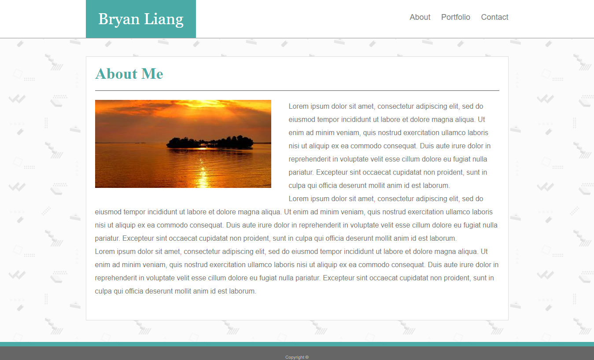
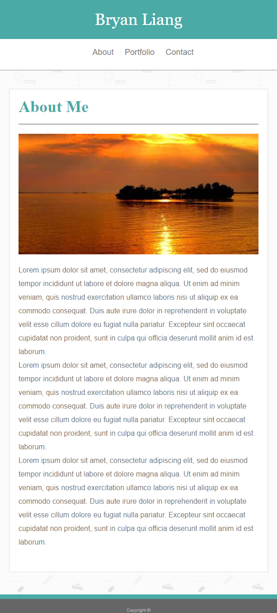

<!-- Put the name of the project after the # -->
<!-- the # means h1  -->
# Responsive Portfolio

<!-- Put a description of what the project is -->
Building a professional portfolio while learning how to use media queries in CSS. A media query is using the @media rule to change the CSS when certain conditions are met. For example, when the screen size reaches a certain size, the content in the webpage will adopt a new set of CSS rules.

# Link to Deployed Site
<!-- make a link to the deployed site --> 
<!-- [What the user will see](the link to the deployed site) -->
[Responsive Portfolio](https://liangbryan2.github.io/Responsive-Portfolio/)

# Images
<!-- take a picture of the image and add it into the readme  -->
<!--  -->



# Technology Used
<!-- make a list of technology used -->
<!-- what you used for this web app, like html css -->


<!-- 
1. First ordered list item
2. Another item
⋅⋅* Unordered sub-list. 
1. Actual numbers don't matter, just that it's a number
⋅⋅1. Ordered sub-list
4. And another item. 
-->
- HTML
- CSS

# code snippets
<!-- put snippets of code inside ``` ``` so it will look like code -->
<!-- if you want to put blockquotes use a > -->

``` css
@media screen and (max-width: 768px) {
    p.tag {
        font-size: 0.5em;
    }

    header {
        height: 132px;
    }

    img {
        max-width: 100%;
        height: auto;
    }

    #navbar {
        justify-content: center!important;
        align-items: center;
    }

    #header-row, #header-container {
        padding-left: 0;
        padding-right: 0;
        margin-left: 0;
        margin-right: 0;
        width: 100vw;
    }
}
```

# Learning points
<!-- Learning points where you would write what you thought was helpful -->
Media queries are very useful becuase you do not have to re-write a whole new stylesheet for mobile screens. You can just put in the @media rule into your existing CSS file and adjust from there. A downside I can see is that if a device has a screen size that is somewhere inbetween the standard sizes, desktop --> tablet --> phone, the website might look funky. You combat this by adding breakpoints for many screen sizes.

# Author 
<!-- make a link to the deployed site and have your name as the link -->
[Bryan Liang](https://github.com/liangbryan2)

# License
Standard MIT License
